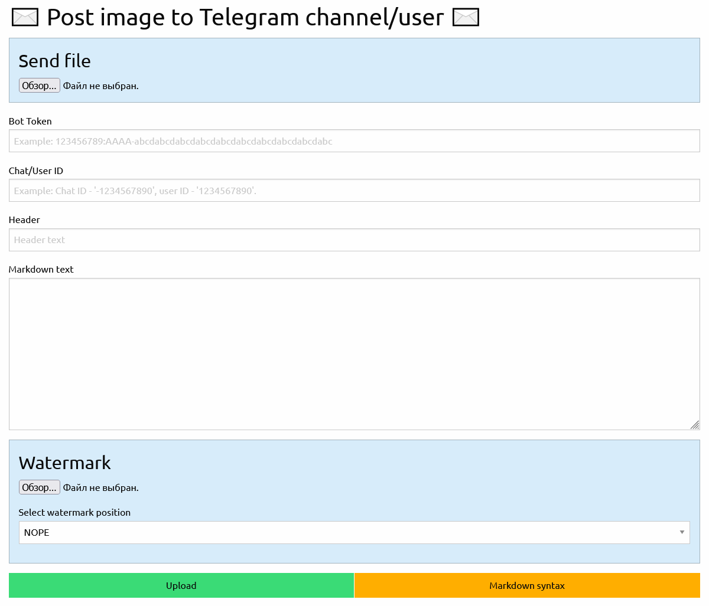

# ✉️ TBot Sender ✉️



## 🟢 Start project

1) Install `pipenv`
   ``` bash
   pip install pipenv
   ```
2) Install dependencies
   ```bash
   pipenv install
   ```
3) Start project
   ``` bash 
   uvicorn main:app --reload
   ```
   _or_
   ``` bash
   pipenv run uvicorn main:app --reload
   ``` 
4) Build Docker image
   ``` bash
   docker build --no-cache -t marolok/t_sender:1.0.0 .
   ```

   ``` bash
   docker push marolok/t_sender:1.0.0
   ```